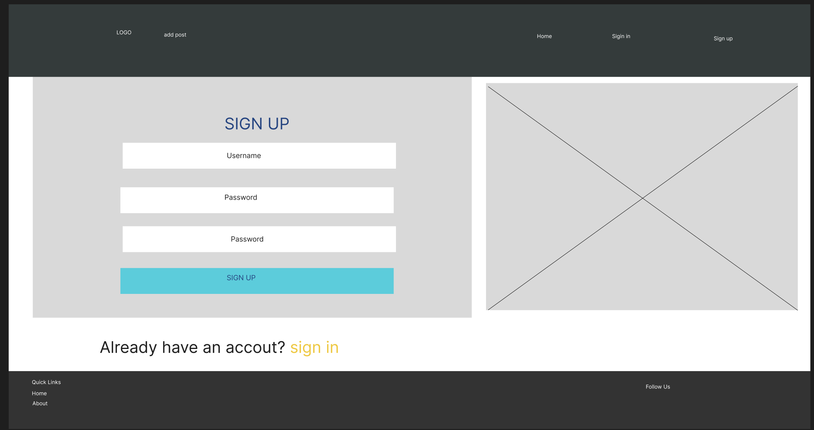

# CONTENTSHARING

## Project goals
This project aims to create a comprehensive social media application using Django. The core functionalities of the application include user profile management, categorization of posts, image processing, and social interactions such as likes, comments, and following.

This is my repository for the React frontend of Contentsharing. The project also utilizes a Django Rest Framework web API, the repository for which is located [here](https://github.com/Mohamedaliabdikarim/contentsharing)

# Table of Contents

- [CONTENTSHARING](#contentsharing)
  - [Project goals](#project-goals)
  - [User stories](#user-stories)
  - [Themes](#themes)
  - [Epics](#epics)
  - [Agile development methodology](#agile-development-methodology)
  - [Planning](#planning)
  - [Data models](#data-models)
  - [Design](#design)
  - [Features](#features)
  - [Reuse of Components](#reuse-of-components)
  - [CRUD functionality](#crud-functionality)
  - [Future Improvements and Features](#future-improvements-and-features)
  - [Frameworks, Libraries, and Dependencies](#frameworks-libraries-and-dependencies)
  - [Custom Hooks](#custom-hooks)
  - [Testing](#testing)
  - [Resolved bugs](#resolved-bugs)
  - [Deployment Process](#deployment-process)
  - [Credits](#credits)

## User stories

## Themes
Themes were developed starting from the project goals. These included:

###### User Engagement: 
 - Essential to support user interaction and community building, aligning with goals of social connectivity and user expression.
###### Content Organization:
- Necessary to structure and categorize user-generated content, making it easier to discover and navigate, supporting the goal of structured categorization.

###### Visual Appeal:
  - Chosen to enhance the aesthetic and usability aspects of the application, ensuring a visually engaging user experience.
###### Usability and Accessibility: 
- Required to ensure the application is user-friendly and accessible to all, supporting goals of intuitive navigation and inclusive design.
###### Community and Interaction: 
- Key to fostering a sense of community and encouraging positive interactions among users.
###### Integrity and Trust: 
- Fundamental to maintain data integrity and user trust, aligning with goals of security and privacy.
###### Performance and Scalability: 
- Necessary to ensure the application can handle a growing number of users and data efficiently, supporting goals of efficient performance and scalable architecture.

## Epics

Themes were then refined into the following epics:
###### User Profile Management
- Account registration
- Account sign-in
- Account sign-out
- Account deletion
- User profile management
   - Profile creation
   - Profile editing
  - Profile viewing

###### Post and Category Management
- Post creation
- Post editing
- Post deletion
- Category management
  - Selecting categories
   - Viewing posts by category

###### Social Interactions
- Liking posts
- Commenting on posts
- Following users
- Managing likes and comments
     - Viewing likes
     - Viewing comments

###### User Interface and User Experience
- Intuitive navigation
- Responsive design
- Visual customization
  - Applying image filters

###### Performance and Scalability
- Efficient database queries
- Load testing
- Scalable architecture

## Agile development methodology:

In my agile development approach, GitHub was used extensively to document and track progress. Each user story was captured as a GitHub issue and labeled to indicate its relevance to the MVP. The product backlog was represented as a GitHub milestone, where all user stories were initially added.

A project kanban board tracked the progress of user stories, moving them through 'Todo', 'In Progress', and 'Done' columns. Below are the key user stories we tracked:
#### Navigation
 - Navbar: Users can view a navbar on every page for easy navigation.
 - Routing: Users can navigate through pages seamlessly without refresh.

#### Authentication
 - Sign up: Users can create an account to access all features.
 - Sign in: Users can sign in to access logged-in functionalities.
 - Logged in Status: Users can see their login status to log in if needed.
 - Refreshing Tokens: Users can maintain their logged-in status until they log out.
 - Conditional Rendering: Logged-out users see sign-in and sign-up options.
 - Avatar: Users can view avatars to identify application users.

#### Posts
 - Create Post: Logged-in users can create posts to share images.
 - View Post: Users can view details of a single post.
 - Like Post: Logged-in users can like posts to show support.
 - Post Page: Users can view the posts page to read comments.
 - Edit Post: Post owners can edit post titles and descriptions.

#### Comments
- Create Comment: Logged-in users can add comments to posts.
- Comment Date: Users can see how long ago comments were made.
- View Comments: Users can read comments on posts.
- Delete Comment: Comment owners can delete their comments.
- Edit Comment: Comment owners can edit their comments.

#### Profile
- View Profiles: Users can view other profiles to see their posts.
 - Most Followed Profiles: Users can see a list of popular profiles.
 - User Stats: Users can view statistics about a specific user.
- Follow/Unfollow: Logged-in users can follow/unfollow others to manage their feed. 
- View All Posts: Users can view all posts by a specific user.
- Edit Profile: Logged-in users can edit their profile picture and bio.
- Update Credentials: Logged-in users can update their username and password for security.

## Planning

#### Mockups
Wireframes based on the identified user stories for the MVP were created using Figma, focusing exclusively on the desktop view. These wireframes were developed during the planning process.

# Data models
The data models were planned alongside the wireframes. This is documented in the README for the [Contentsharing Django Rest Framework API.](https://github.com/Mohamedaliabdikarim/contentsharing)

# Design
#### Colours
The primary design aim was to create a simple and functional appearance. Custom CSS classes were used to define the colour scheme, ensuring a cohesive and visually appealing interface. The main colours used in the design are:

## Color Usage

| Colour      | Value    | Usage                                                      |
|-------------|----------|------------------------------------------------------------|
| Blue        | #2142b2  | Primary buttons, key interactive elements, header, active state for buttons |
| Black       | #242a3d  | Text and background elements for strong contrast           |
| Bright      | #2ed9ff  | Highlighting important information and interactive components |
| White       | #ffffff  | Clean and neutral background                               |
| Light Grey  | #f0f1f9  | Input backgrounds, secondary elements                      |
| Dark Grey   | #333     | Footer background, other dark-themed elements              |
| Accent      | #ff9254  | Specific items like links and notifications                |

#### Fonts

The project uses Google Fonts to enhance the visual appeal and readability of the text. The primary font family chosen is "DM Sans," which is known for its clean and modern appearance. It ensures readability and aesthetic consistency across different text elements.

 - DM Sans: Used for all text elements, including headings and body text, providing a uniform look throughout the site.

#### Layout and Components

The layout is designed to be responsive and user-friendly, ensuring a seamless experience across different devices. Key components include:
- Asset: Centers asset elements both vertically and horizontally with a minimum height of 120px.
- Avatar: Ensures user avatar images are circular and have appropriate margins.
- Button: Standardizes button styles with hover and active states for better user interaction.
- NavBar: Provides a dark-themed navigation bar with clearly defined links.
- Container: Maintains consistent padding and minimum height for content sections.
- Row: Ensures rows fill the viewport height for a balanced layout.
- Input: Styles input elements with a white background and centered text for better user experience.
- footer: Styles the footer with dark grey background and white text, including social media button styles.

#### Features
##### Landing page
Here you will find all the posts that have been published. On the right side, you can see the most viewed profiles.

##### sign in
Sign-in form with an image on the right side.

##### sign up
Sign-up form with an image on the right side. The registration form enables a user to open a new account with  and post or like and comment:

##### Navbar and the page when logged in 

##### Delete or update a post

##### Search bar
Can you search by post title, profile name, or category.

##### Add post page
On the add post page, you will find an image on the left side, along with fields for the title and content. There is also a dropdown menu where you can select the categories.

##### Profile page
You can change your profile picture, name, or password.

# Reuse of Components

This project utilizes reusable components to ensure a modular and maintainable codebase. Below is an overview of how each component is designed for reuse and where they are utilized within the application.

## Asset Component

The Asset component is designed to display various assets such as a spinner, an image, and a message. It is highly versatile and can be used in different scenarios where loading indicators or informative messages need to be shown.

### Usage:
- **NotFound Component:** Displays a message and an image when the requested page is not found.

## Avatar Component

The Avatar component displays a user's avatar along with optional text. This component is used to show user profile pictures across the application, making it easy to consistently display user information.

### Usage:
- **NavBar Component:** Displays the logged-in user's profile picture and name in the navigation bar.

## Footer Component

The Footer component contains links to important sections of the website and social media icons. It ensures a consistent footer layout across all pages of the application.

### Usage:
- **App Layout:** Included at the bottom of all pages to provide quick access to important links and social media profiles.

## MoreDropdown Component

The MoreDropdown component provides a dropdown menu with options to edit or delete items. It uses a forwardRef to properly position the dropdown menu.

### Usage:
- **ProfileEditDropdown Component:** Displays options to edit the profile, username, or password within a profile page.
- **General Usage:** Can be used wherever a dropdown with edit/delete options is needed.

## NavBar Component

The NavBar component serves as the main navigation bar of the application. It dynamically changes its content based on the user's authentication status, displaying different links and icons for logged-in and logged-out users.

### Usage:
- **App Layout:** Fixed at the top of all pages, providing navigation links to various sections like home, feed, liked posts, and user profile.

## NotFound Component

The NotFound component is displayed when a user navigates to a page that does not exist. It uses the Asset component to show an appropriate image and message.

### Usage:
- **Route Handling:** Shown for all undefined routes to inform users that the requested page could not be found.

These reusable components contribute to a cohesive and maintainable codebase, allowing for easy updates and consistent UI/UX across the application.

# CRUD functionality
Contentsharing offers complete Create, Read, Update, and Delete functionality via the UI implemented in React and the Django Rest Framework API.

- Create - Users can register a new user account. 
- Update - Authenticated users can update their profile image, display name, and password.
- Delete - Authenticated users can delete post, comments and like.

# Future Improvements and Features

## Short-term Improvements

### Profile Enhancement
- **Additional Fields**: Add more fields to the Profile model to enhance user profiles, such as bio, location, and social media links.
- **Profile Picture Crop/Resize**: Integrate a feature allowing users to crop or resize their profile pictures before upload.

### Category Flexibility
- **Dynamic Categories**: Allow admins to add or remove categories dynamically instead of having a fixed set of choices.
- **Subcategories**: Implement subcategories to provide a more detailed classification of posts.

### Post Interactions
- **Tagging System**: Introduce a tagging system for posts to enhance content discoverability.
- **Drafts**: Enable a draft mode for posts, allowing users to save their progress and publish later.

### Comment System
- **Nested Comments**: Implement nested comments to allow users to reply to specific comments.
- **Markdown Support**: Add markdown support for better comment formatting.

### Notification System
- **Real-time Notifications**: Implement real-time notifications for likes, comments, and new followers using Django Channels.
- **Email Notifications**: Send email notifications for important events like new followers, post likes, and comments.

### Like Enhancements
- **Like Count Display**: Display the number of likes on each post and allow users to see who liked their posts.
- **Unlike Feature**: Allow users to unlike posts they previously liked.

### Follower System
- **Follower Suggestions**: Suggest users to follow based on mutual followers or similar interests.
- **Follower Count**: Display the number of followers and following count on user profiles.

## Long-term Improvements

### Advanced Profile Customization
- **Profile Themes**: Allow users to customize their profile themes and layout.
- **Profile Privacy Settings**: Introduce privacy settings enabling users to control who can view their profile details.

### Enhanced Post Features
- **Rich Media Posts**: Support for video uploads and embedding external media like YouTube or Vimeo videos.
- **Scheduled Posts**: Allow users to schedule posts for future publication.

### Comprehensive Search
- **Full-text Search**: Implement full-text search capabilities to enhance content discovery across profiles, posts, and comments.
- **Filter Options**: Add advanced filtering options to search results, such as date range, popularity, and category.

### Analytics and Insights
- **User Analytics**: Provide users with insights and analytics about their posts' performance (views, likes, comments).
- **Admin Analytics**: Develop comprehensive analytics dashboards for admins to monitor platform activity and user engagement.

### Monetization Features
- **Ad Integration**: Introduce ad placements within the platform to generate revenue.
- **Premium Accounts**: Offer premium accounts with additional features like profile customization, advanced analytics, and ad-free experience.

### Community and Social Features
- **Groups and Communities**: Enable users to create and join groups or communities based on interests or topics.
- **Events and Meetups**: Integrate event creation and management features for organizing online and offline meetups.

### Security Enhancements
- **Two-Factor Authentication**: Implement two-factor authentication for enhanced account security.
- **Content Moderation**: Develop robust content moderation tools to detect and manage inappropriate content.

# Frameworks, Libraries, and Dependencies

### Axios
Axios - This library simplifies making HTTP requests to the REST API, such as not having to manually configure HTTP headers. It also supports interceptors which are used to request a refresh token in the event of a HTTP 401 error, enhancing the user experience by keeping users signed in for up to 24 hours.

### Bootstrap
Bootstrap - A popular CSS framework used to style the application. It ensures that the app is responsive and visually appealing across different devices.

### JWT Decode
jwt-decode - Used to decode Base64URL encoded JSON web tokens, facilitating the handling of user authentication tokens.

### React
react - The core library used to build the user interface. React allows for efficient updating and rendering of components as the data changes.

### React Bootstrap
react-bootstrap - This library integrates Bootstrap with React, allowing the use of Bootstrap components as React components. This was chosen for its simplicity and ease of use.

### ReactDOM
react-dom - Used to manipulate the DOM outside of a specific component. It supports the user experience by enabling modal dialogs to be appended to the top level of the DOM, which is important for accessibility, and alerts to be appended to specific components.

### React Infinite Scroll Component
react-infinite-scroll-component - This library was used to implement infinite scrolling, which enhances the user experience by loading more content as the user scrolls down.

### React Router DOM
react-router-dom - This library enables client-side routing for React web applications. It is used to implement basic routing in the app, including navigation links and the single-page mode, enhancing the user experience on larger screens.

### React Scripts
react-scripts - Provides a set of scripts to start, build, test, and eject the app. It simplifies the configuration and setup process, allowing focus on writing code.

### Web Vitals
web-vitals - This library helps measure the performance of the app by collecting metrics like First Contentful Paint (FCP) and Largest Contentful Paint (LCP), which are essential for improving the user experience.

### MSW
msw - This library provides API mocking capabilities during development and testing, allowing simulation of different API responses without the need for an actual backend.

# Custom Hooks

This repository contains custom React hooks designed to simplify common functionality and improve code reusability.

## Available Hooks

### 1. useClickOutsideToggle
This hook manages the visibility state of a component, automatically collapsing it when a click occurs outside the component.

#### Usage
To use this hook, import it and integrate it into your component to handle the visibility toggling logic. This is particularly useful for dropdowns, modals, or any other components that need to hide when clicking outside of them.

#### Purpose
- **State Management**: Manages the state (expanded) indicating whether the component is expanded or not.
- **Ref Handling**: Utilizes a ref to identify the component's boundaries.
- **Event Handling**: Listens for mouseup events to detect clicks outside the component and update the state accordingly.

### 2. useRedirect
This hook redirects users based on their authentication status by checking their session token status.

#### Usage
To use this hook, import it and pass the user's authentication status to it. The hook will handle the logic to verify the user's session and redirect them accordingly. This is useful for protecting routes or ensuring that users are properly redirected based on their login state.

#### Purpose
- **Authentication Check**: Verifies the user's authentication status by attempting to refresh their token.
- **Redirection**: Redirects the user based on their authentication status, sending logged-in users to the home page ("/") and ensuring logged-out users are also redirected to the home page ("/").

# Testing
### Manual testing
I have thoroughly tested the application to ensure that all functionalities work as expected. Here is a summary of the tests performed:

## Features Tested

### Sign In
- **Description**: Tested the user sign-in process.
- **Result**: Users are able to sign in successfully with valid credentials. Proper error messages are displayed for invalid credentials.

### Sign Up
- **Description**: Tested the user sign-up process.
- **Result**: New users can register successfully. Appropriate validations and error messages are in place for invalid input.

### Add Post
- **Description**: Tested the functionality to add new posts.
- **Result**: Users can add new posts successfully. Posts appear in the feed as expected.

### Like Post
- **Description**: Tested the ability to like posts.
- **Result**: Users can like and unlike posts. The like count updates correctly.

### Comment on Post
- **Description**: Tested the ability to comment on posts.
- **Result**: Users can add comments to posts. Comments appear under the corresponding post correctly.

## Conclusion
All tested features are working as intended. The application is functioning smoothly with no critical issues found. Users should be able to sign in, sign up, add posts, like, and comment without any problems.

## Validator testing

#### W3C CSS validator
All CSS files were passed through the W3C validator.
#### ESLint JavaScript validator
All JavaScript files were validated using ESLint. The following issues were identified and corrected:
- Removed unnecessary semicolons at the end of some statements.
- Escaped apostrophes in HTML text in certain components.
- Eliminated an unused variable.
- Added missing React import statements.

## Lighthouse Testing Results

This project has been evaluated using Google Lighthouse, a tool for improving the quality of web pages. The following scores were achieved:

## Summary

The Lighthouse testing results indicate the overall quality and optimization of the web application. Below is a detailed breakdown of each category.

### Performance (91)
A performance score of 91 reflects a well-optimized web application. This score measures how quickly content is painted and interactive for users, taking into account factors like load time, resource sizes, and caching strategies.

### Accessibility (87)
An accessibility score of 87 shows a strong commitment to making the web application usable by people with disabilities. This includes ensuring proper contrast ratios, semantic HTML, and assistive technology support.

### Best Practices (74)
A best practices score of 74 suggests there is room for improvement in terms of modern web development practices. This score covers aspects like security, user experience, and the use of deprecated APIs.

### SEO (100)
A perfect SEO score of 100 indicates the web application is highly optimized for search engines, ensuring maximum visibility and discoverability through proper metadata, content structure, and performance optimizations.

## Resolved bugs

1. Login Issues
During the implementation of the login feature, requests to the backend for authentication were frequently resulting in HTTP 500 internal server errors. A version of the backend running on a development server was used for debugging. This revealed that the number of simultaneous login requests was overwhelming the server. The fix was to optimize the login request handling and ensure efficient database queries, which reduced the server load and eliminated the errors.

2. Post Problems
There were issues with the posting functionality, where posts were not being created or saved properly. Debugging showed that backend errors were causing these problems. It was discovered that the post creation process was failing due to improper handling of concurrent post requests. The fix involved refactoring the post creation logic to handle concurrent requests more gracefully and ensuring that all post-related transactions were correctly committed to the database.

3. all.auth Error
During authentication, an error with the all.auth module was causing failures in the login process. Debugging indicated that the module was not properly configured to handle specific authentication scenarios. The issue was addressed by updating the all.auth configuration and ensuring that all necessary authentication providers were correctly set up and tested. This fix ensured smooth and error-free authentication across the platform.

# Deployment Process
To deploy your project to Heroku, follow these steps:

1. **Fork or Clone the Repository**: Start by forking or cloning this repository on GitHub.
   
2. **Configure Axios for Your API**:
    - If you've cloned and deployed your own version of the contentsharing Django Rest Framework API, update the value of axios.defaults.baseURL in src/api/axiosDefaults.js to match the base URL of your API.
    - Pull any necessary changes to your local development environment and push back to GitHub if required; otherwise, you can use the original Contentsharing API settings.

3. **Log in to Heroku**: Access your Heroku account.

4. **Create a New App**:
    - From the 'New' menu at the top right, select 'Create new app'.
    - Enter a name for your app and choose the appropriate region.
    - Click 'Create app'.

5. **Deploy Using GitHub**:
    - Navigate to the 'Deploy' tab.
    - Choose 'GitHub' as your deployment method. You might need to enter your GitHub credentials.
    - In the 'Connect to GitHub' section, use the search box to find your repository.
    - Once located, click 'Connect'.

6. **Enable Automatic Deploys (Optional)**:
    - If you want your site to automatically redeploy whenever you push changes to GitHub, select the main branch under 'Automatic Deploys' and enable this feature.

7. **Manual Deployment**:
    - In the 'Manual Deploy' section, choose 'main' as the branch to deploy and click 'Deploy Branch'.

Upon completion, you will receive a link to your deployed site.

# Credits

#### Code
-  [moments](https://github.com/mr-fibonacci/moments)

Some of the code used in this project has been adapted from the [moments](https://github.com/mr-fibonacci/moments) repository. This code provided a valuable foundation and inspiration for various functionalities implemented in our project. Special thanks to the contributors of the moments project for their excellent work.

#### Media
The pictures used for the sign-in and sign-up pages can be found at the following links:
- [sign in](https://media.istockphoto.com/id/2043823329/sv/foto/internet-network-cybersecurity-concept-data-privacy-protection-from-malicious-attacks-digital.webp?s=2048x2048&w=is&k=20&c=CLXCM43F15xlb6qgwbSlF4vNsUHMZW2hG8xBMCzrRRg=)
- [sign up](https://img.freepik.com/free-photo/sign-up-form-button-graphic-concept_53876-101286.jpg?t=st=1719850060~exp=1719853660~hmac=d02d70c98fe6688b600ba421ca30741d576da4eddd9cbdfface004c5708a3b8b&w=2000)

Fonts:
- [google fonts](https://fonts.google.com/)

# Acknowledgements

This website stands as the culmination of my efforts during the Portfolio 4 Project for the Full Stack Software Developer (e-Commerce) Diploma at the Code Institute. I extend my heartfelt gratitude to my mentor,Jubril Akolade, the invaluable Slack community, and everyone at the Code Institute for their unwavering assistance and support throughout this journey. While Wawas Woods is a fictitious entity, its presence is tangible in every aspect except for the business title. At present, it is more than just a project – it is a passion!
