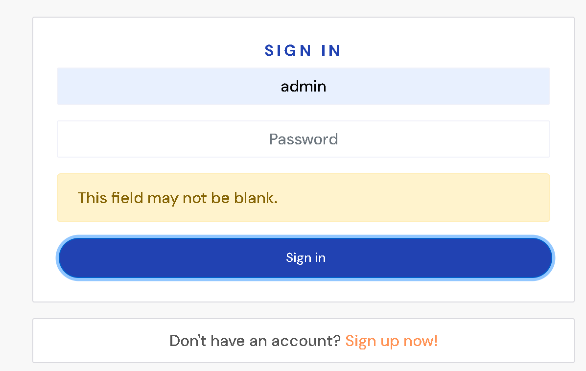
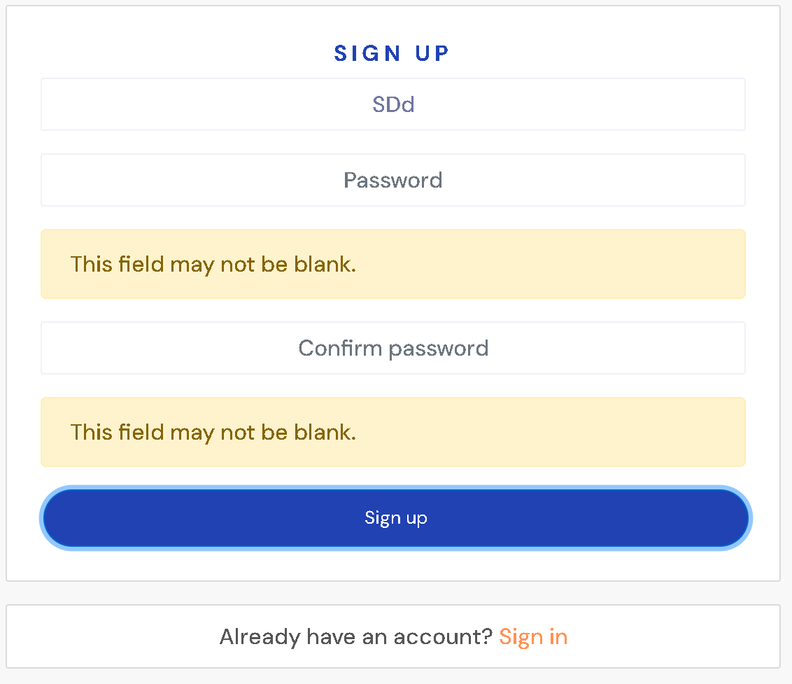
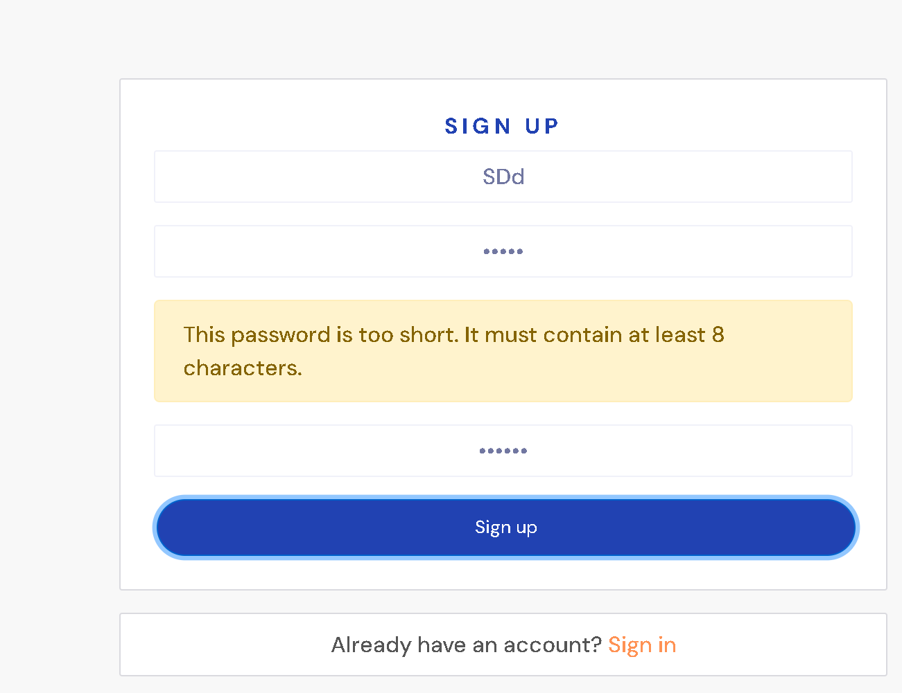
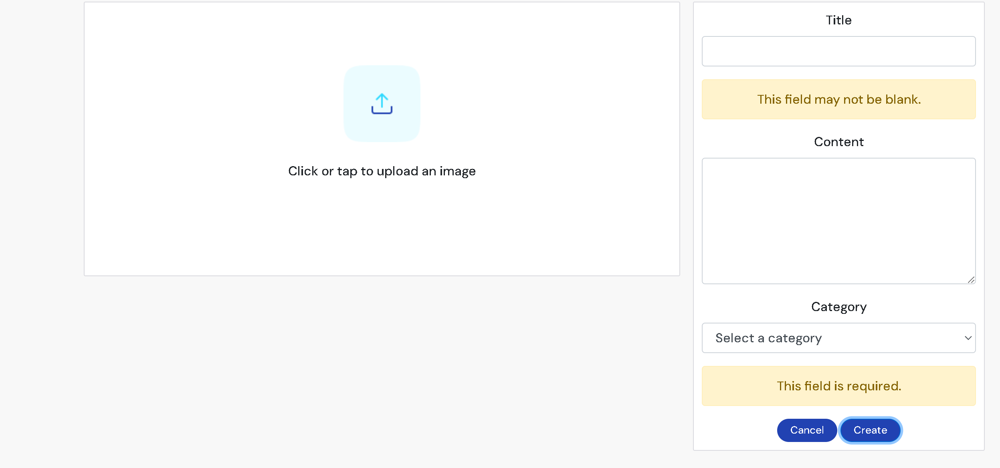
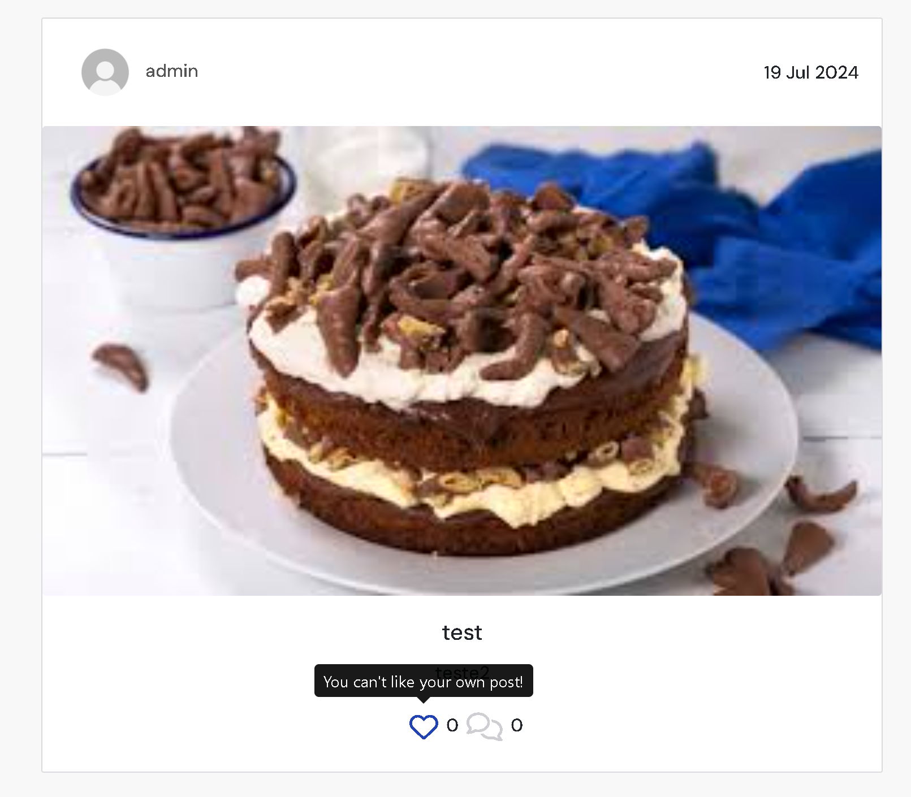
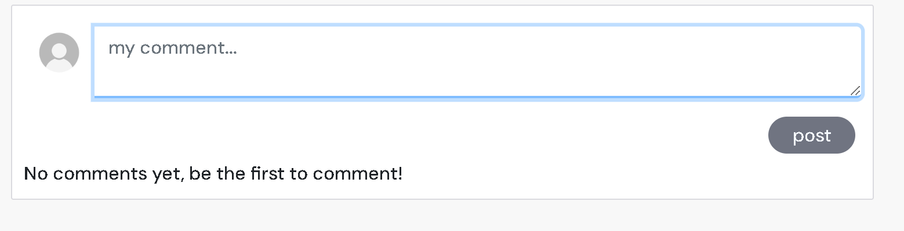
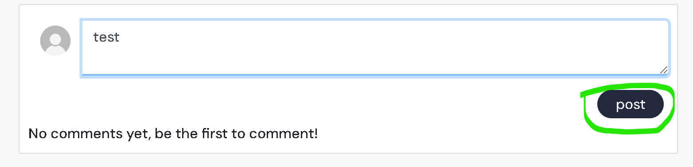

# Testing
### Manual testing
I have thoroughly tested the application to ensure that all functionalities work as expected. Here is a summary of the tests performed:

## Features Tested

### Sign In
- **Description**: Tested the user sign-in process.

- **Result**: Users are able to sign in successfully with valid credentials. Proper error messages are displayed for invalid credentials.

### Sign Up
- **Description**: Tested the user sign-up process.
- **Result**: New users can register successfully. Appropriate validations and error messages are in place for invalid input.

### Add Post
- **Description**: Tested the functionality to add new posts.

- **Result**: Users can add new posts successfully. Posts appear in the feed as expected.

### Like Post
- **Description**: Tested the ability to like posts.

- **Result**: Users can like and unlike posts. The like count updates correctly.

### Comment on Post
- **Description**: Tested the ability to comment on posts.

- **Result**: Users can add comments to posts. Comments appear under the corresponding post correctly.

## Conclusion
All tested features are working as intended. The application is functioning smoothly with no critical issues found. Users should be able to sign in, sign up, add posts, like, and comment without any problems.

